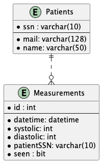

## Database schema
The database design is going to be as follows. One table will contain all patients with their SSN-number as the key, and the other table, named Measurements, will have an incremental id number. One patient can have 0 to many measurements, and one measurement will belong to one, and only one, patient,

