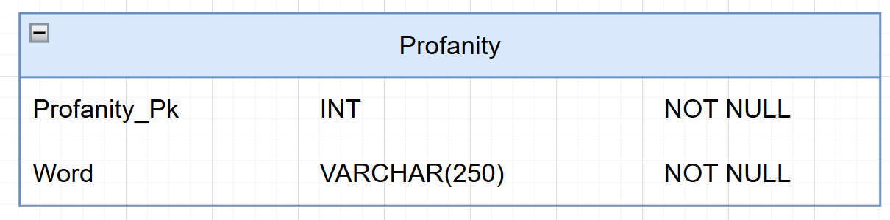

<!-- Create a database schema of the database and display it here -->

# Database for Profanity
Database containing a single table over words considered profanity.  
each word is linked to a primary.  
The database is to be written in a mongo database.

Additionally, we plan to use a redish database for caching.